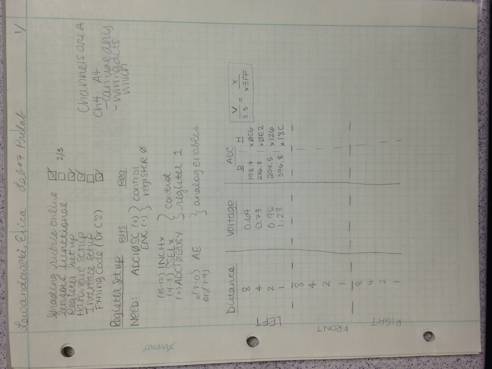
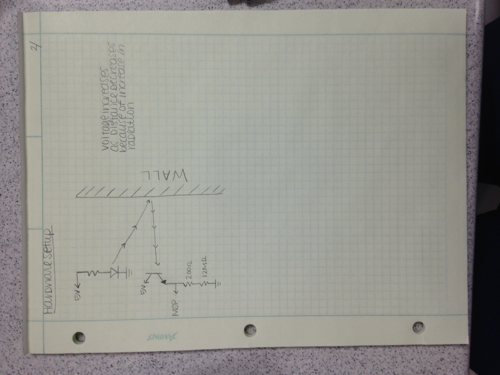

ECE382-Lab7
===========
#Prelab

Grading Rubric

| ITEM | GRADE | POINTS | OUT OF | DATE | DUE |
|------|-------|--------|--------|------|-----|
| Prelab | 0, check minus, check, check plus |  | 10 | | BOC L37|
| Required FXN | On time, late |  | 40 |  | COB L38 |
| B FXN | On time, late |  | 10 |  | COB L38 |
| A FXN | On time, late |  | 10 |  | COB L38 |
| Use of GitHub | On time (check system), late |  | 10 |  | COB L40 |
| Code Style | On time(check system), late |  | 10 |  | COB L40 |
| README | On time(check system), late |  | 10 |  | COB L40 |

!

#Code Walkthrough
-The main loop utilizes a while loop to read each sensor 
-When the sensor detects a wall or something near, it triggers one or both of the LEDs

int main(void) {

	unsigned char i = 0;										// index into sample array

	IFG1=0; 													// clear interrupt flag1
	WDTCTL = WDTPW + WDTHOLD;									// disable WDT

	BCSCTL1 = CALBC1_8MHZ;										// 8MHz clock
	DCOCTL = CALDCO_8MHZ;

	P1DIR = BIT0 | BIT6;

	// Set the red LED as output

	while(1) {

		  // Configure P1.4 to be the ADC input LEFT
		ADC10CTL0 = 0;											// Turn off ADC subsystem
		ADC10CTL1 = INCH_4 | ADC10DIV_3 ;						// Channel 4, ADC10CLK/4
		ADC10AE0 = BIT4;		 								// Make P1.4 analog input
		ADC10CTL0 = SREF_0 | ADC10SHT_3 | ADC10ON | ENC;		// Vcc & Vss as reference

		ADC10CTL0 |= ADC10SC;									// Start a conversion
		while(ADC10CTL1 & ADC10BUSY);							// Wait for conversion to complete
		sampleL[i] = ADC10MEM;									// collect that 10-bit value
		if (sampleL[i] > 0x0200)	P1OUT |= BIT0;
		else						P1OUT &= ~BIT0;

		//i = (i+1) & 0xF;							// This is a mod 16 increment

		 // Configure P1.3 to be the ADC input RIGHT
				ADC10CTL0 = 0;											// Turn off ADC subsystem
				ADC10CTL1 = INCH_3 | ADC10DIV_3 ;						// Channel 3, ADC10CLK/4
				ADC10AE0 = BIT3;		 								// Make P1.3 analog input
				ADC10CTL0 = SREF_0 | ADC10SHT_3 | ADC10ON | ENC;		// Vcc & Vss as reference

				ADC10CTL0 |= ADC10SC;									// Start a conversion
				while(ADC10CTL1 & ADC10BUSY);							// Wait for conversion to complete
				sampleR[i] = ADC10MEM;									// collect that 10-bit value
				if (sampleR[i] > 0x0200)	P1OUT |= BIT6;
				else						P1OUT &= ~BIT6;

				//i = (i+1) & 0xF;							// This is a mod 16 increment

		// Configure P1.5 to be the ADC input CENTER
				ADC10CTL0 = 0;											// Turn off ADC subsystem
				ADC10CTL1 = INCH_5 | ADC10DIV_3 ;						// Channel 2, ADC10CLK/4
				ADC10AE0 = BIT5;		 								// Make P1.2 analog input
				ADC10CTL0 = SREF_0 | ADC10SHT_3 | ADC10ON | ENC;		// Vcc & Vss as reference

				ADC10CTL0 |= ADC10SC;									// Start a conversion
				while(ADC10CTL1 & ADC10BUSY);							// Wait for conversion to complete
				sampleC[i] = ADC10MEM;									// collect that 10-bit value
				if (sampleC[i] > 0x0200)	P1OUT |= BIT0 | BIT6;
				else						P1OUT &= ~(BIT0|BIT6);

				i = (i+1) & 0xF;							// This is a mod 16 increment

	} // end infinite loop

} // end main

#Debugging
My original robot's front sensor had bad wiring, so I had to rewire and reprogram a new robot. Once I got the new robot working, I had to get a new MSP430 chip because one of my LEDs was out. 

#Documentation 
Dr. Coulston and Capt Trimble both helped with troubleshooting when the robot and LED weren't working. 
